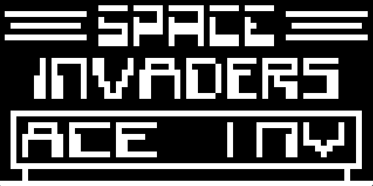
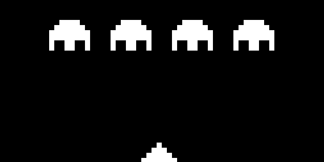

# The CHIP-8 Emulator

This is a CHIP-8 emulator written in C totally from scratch using the SDL2 library for graphics and input handling. The emulator supports basic CHIP-8 functionality, including memory management, opcode execution, and display rendering.

||||
|-|-|-|

## Features
- Emulates the CHIP-8 virtual machine
- Uses SDL2 for rendering graphics and handling input
- Modular code structure for easy maintenance and extension

## Getting Started

### Downloading and Building:
1. Clone the repository:
   ```bash
    git clone https://github.com/yourusername/chip-8-emulator.git

    cd chip-8-emulator/
    ```
2. Build the project using the provided Makefile:
   ```bash
   make
   ```
3. Run the emulator:
   ```bash
   make run
   ```
### Requirements:
- MINGW GCC compiler
- GNU Make
- The SDL2 library (the librarie included in the `lib` directory is already compiled for MINGW)


## References

- [CHIP-8 Wikipedia Page](https://en.wikipedia.org/wiki/CHIP-8)
- [CHIP-8 Technical Reference](http://devernay.free.fr/hacks/chip8/C8TECH10.HTM)
- [GAME ROMs for CHIP-8](https://www.zophar.net/pdroms/chip8/chip-8-games-pack.html)
- [Iniciando no desenvolvimento de emuadores com CHIP-8](https://linux.ime.usp.br/~dpa/mac0499/monografia.pdf)
- [Dmatlack's CHIP-8 Emulator in C](https://github.com/dmatlack/chip8)
- [Nibblebits's CHIP-8 Emulator in C](https://github.com/nibblebits/Chip8InCCourse/tree/master)
